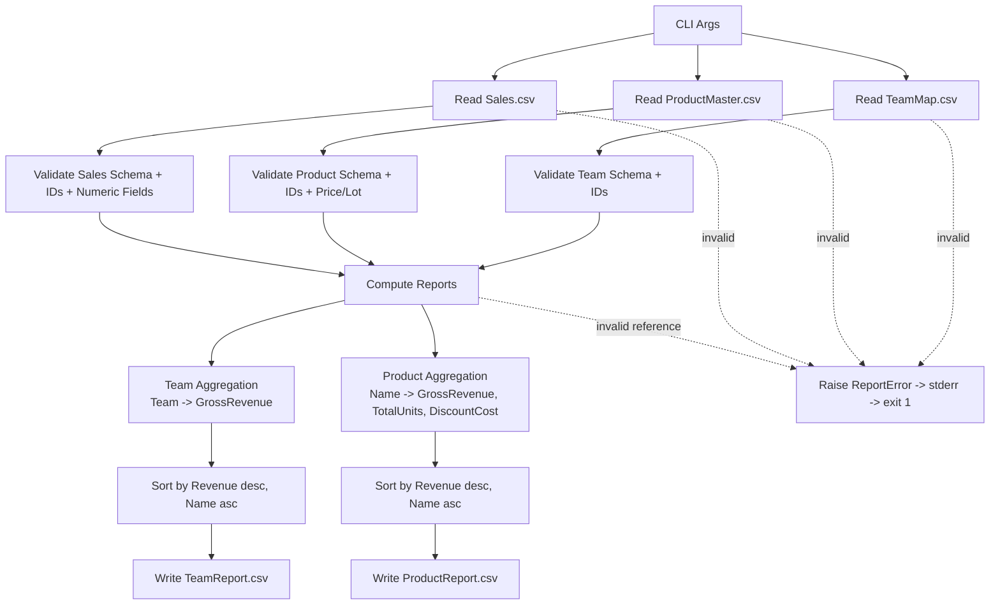

# XR Trading Internship Challenge 

## 1) Overview
This repository contains a production-oriented Python 3 command-line application that ingests three CSV datasets, validates and joins them, and generates two deterministic sales reports.

Primary objective:
- Generate team-level and product-level revenue analytics from raw trading sales records.

Design objective:
- Be safe to run in a production pipeline by failing fast on invalid data, using deterministic ordering, and using precise financial arithmetic.

---

## 2) Technology and Constraint Alignment
This implementation is aligned with your stated constraints:

1. **Python 3 or higher**
	 - The script is implemented for Python 3 (`#!/usr/bin/env python3`) and uses Python 3 features (`from __future__ import annotations`, type hints).

2. **Built-in packages only**
	 - Only standard library modules are used:
		 - `argparse`
		 - `csv`
		 - `sys`
		 - `collections.defaultdict`
		 - `decimal.Decimal`
	 - No third-party dependency (for example `pandas`) is required.

3. **Production-ready engineering standards**
	 - Strict schema validation and referential integrity checks.
	 - Structured error model via a custom `ReportError` exception.
	 - Deterministic outputs (stable sort/tie-break rules).
	 - Decimal-based money handling to avoid floating-point drift.
	 - Fail-fast behavior with non-zero exit code on invalid input.

---

## 3) Repository File Inventory (What each file contains and why)

### `report.py`
**Contains:**
- End-to-end reporting pipeline:
	- CLI parsing
	- CSV ingestion
	- validation
	- report computation
	- CSV output generation

**Why it exists:**
- This is the executable application entrypoint and the source of all business logic.

### `TeamMap.csv`
**Contains:**
- Team lookup master data with header: `TeamId,Name`
- Current rows:
	- `1,Alpha Wolves`
	- `2,Beta Sharks`
	- `3,Gamma Owls`

**Why it exists:**
- Provides canonical mapping from `TeamId` in transactions to human-readable team names in reports.

### `ProductMaster.csv`
**Contains:**
- Product lookup and pricing data without header.
- Row shape: `ProductId,Name,Price,LotSize`
- Current products include `Micro Future`, `Index Option`, `Volatility Swap`, `Macro Basket`.

**Why it exists:**
- Supplies product metadata and pricing semantics needed to compute unit-level revenue from lot-based quantities.

### `Sales.csv`
**Contains:**
- Transaction facts without header.
- Row shape: `SaleId,ProductId,TeamId,Quantity,Discount`
- Current sample has 7 sales rows.

**Why it exists:**
- This is the event stream used to compute both reports.
- References both master datasets (`ProductId`, `TeamId`) and carries the quantitative measures (`Quantity`, `Discount`).

### `TeamReport.csv`
**Contains:**
- Aggregated output with header `Team,GrossRevenue`.
- Current generated values:
	- `Beta Sharks,1623`
	- `Alpha Wolves,1180`
	- `Gamma Owls,666`

**Why it exists:**
- Consumer-facing team leaderboard for gross revenue performance.

### `ProductReport.csv`
**Contains:**
- Aggregated output with header `Name,GrossRevenue,TotalUnits,DiscountCost`.
- Current generated values:
	- `Micro Future,1250,100,37.5`
	- `Macro Basket,999,300,33.3`
	- `Index Option,720,100,13.5`
	- `Volatility Swap,500,5,6.25`

**Why it exists:**
- Product-level performance and discount impact report for analytical and pricing review.

### `README.md`
**Contains:**
- Engineering documentation for architecture, data contract, calculations, and operations.

**Why it exists:**
- Defines operational and technical expectations so this project is maintainable and auditable.

---

## 4) Data Flow and Processing Architecture



---

## 5) Input and Output Data Contracts

### Inputs

#### Team map (`TeamMap.csv`)
- **Header required:** `TeamId,Name`
- **Row fields:**
	- `TeamId`: positive integer, unique
	- `Name`: non-empty string

#### Product master (`ProductMaster.csv`)
- **No header expected**
- **Row fields:**
	- `ProductId`: positive integer, unique
	- `Name`: non-empty string
	- `Price`: positive decimal (finite)
	- `LotSize`: positive integer

#### Sales (`Sales.csv`)
- **No header expected**
- **Row fields:**
	- `SaleId`: positive integer, unique
	- `ProductId`: positive integer, must exist in Product master
	- `TeamId`: positive integer, must exist in Team map
	- `Quantity`: positive integer (lot count)
	- `Discount`: non-negative decimal percentage

### Outputs

#### Team report (`TeamReport.csv`)
- Header: `Team,GrossRevenue`
- Sorted by `GrossRevenue DESC`, then `Team ASC`

#### Product report (`ProductReport.csv`)
- Header: `Name,GrossRevenue,TotalUnits,DiscountCost`
- Sorted by `GrossRevenue DESC`, then `Name ASC`

---

## 6) Calculation Model

For each sales row:

- `UnitsSold = Quantity * LotSize`
- `GrossRevenue = UnitsSold * Price`
- `DiscountCost = GrossRevenue * (Discount / 100)`

Important semantics:
- `GrossRevenue` is **not** reduced by discount.
- Discount impact is tracked separately as `DiscountCost`.
- All money calculations use `decimal.Decimal`.

---

## 7) Validation and Error Handling

The application fails fast and exits with status code `1` when any validation fails.

Validation categories:
- Missing or malformed required header (`TeamMap.csv` only)
- Wrong column counts per file
- Duplicate IDs (`TeamId`, `ProductId`, `SaleId`)
- Invalid numeric parsing or sign constraints
- Non-finite decimals (`NaN`, `Infinity` rejected)
- Unknown foreign keys in sales (`ProductId`, `TeamId`)
- Missing files or read/write I/O failures

Errors are emitted as:
- `Error: <reason>` to `stderr`

---

## 8) Usage

Run from repository root:

```bash
python report.py \
	-t TeamMap.csv \
	-p ProductMaster.csv \
	-s Sales.csv \
	--team-report=TeamReport.csv \
	--product-report=ProductReport.csv
```

Expected behavior:
- On success: writes/overwrites both report files and exits `0`.
- On failure: prints an error and exits `1`.

---

## 9) Production Readiness Notes

Current strengths:
- Deterministic and reproducible outputs.
- Financial precision with `Decimal`.
- Clear separation of ingestion, compute, and output functions.
- Defensive input contract enforcement.

Operational assumptions:
- Input files fit in memory for current usage profile.
- UTF-8 encoding is used.

Potential next hardening steps (if scale increases):
- Add automated unit/integration tests.
- Add structured logging for observability.
- Add CI check for schema regressions.
- Add optional streaming mode for very large sales files.

---

## 10) Reproducibility Snapshot

A verified command execution in this workspace:

```bash
python report.py -t TeamMap.csv -p ProductMaster.csv -s Sales.csv --team-report=TeamReport.csv --product-report=ProductReport.csv
```

Exit code: `0`

This produced the current `TeamReport.csv` and `ProductReport.csv` contents listed above.